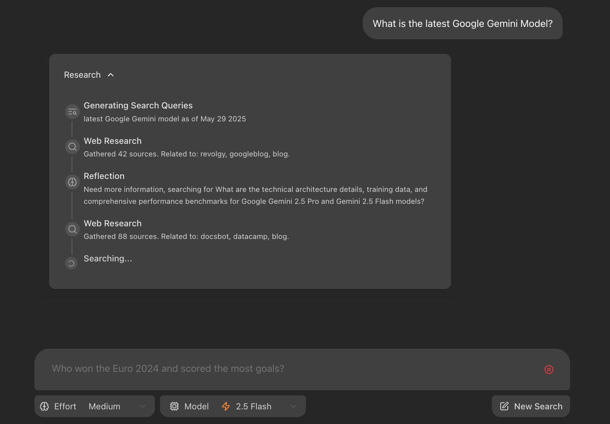

# AutoSpook - OSINT AI Agent System

An intelligent Open Source Intelligence (OSINT) gathering system that leverages multi-agent architecture with LangGraph orchestration to perform comprehensive investigations and generate actionable intelligence reports.

Based on the Gemini Fullstack LangGraph Quickstart, this system extends the research capabilities to focus on OSINT operations with specialized agents for query analysis, multi-source retrieval, pivot analysis, and professional report generation.



## Features

- 🕵️ **Multi-agent OSINT architecture** with 6 specialized intelligence gathering agents
- 🧠 **LLM Integration**: Claude Sonnet 4, GPT-4o, Gemini 1.5 Pro, and Claude Opus 4
- 🔍 **Multi-source intelligence gathering** (web, social media, public records, academic sources)
- 🌐 **Minimum 8-12 strategic retrievals** per investigation across diverse sources
- 💾 **Persistent memory system** with entity graphs and source credibility tracking
- 📊 **Professional intelligence reports** with risk assessment and confidence scoring
- 🎯 **Specialized for investigating** persons, organizations, locations, and events
- 🔄 **Iterative investigation** with intelligent pivoting and follow-up strategies
- ⚡ **UV Package Management** for fast, reliable dependency management

## Agent Architecture

### 6 Specialized OSINT Agents

1. **Query Analysis Agent** (Claude Sonnet 4) - Parses requests and extracts entities
2. **Planning & Orchestration Agent** (Claude Sonnet 4) - Creates strategic investigation plans
3. **Multi-Source Retrieval Agent** (Claude Sonnet 4) - Executes 8-12 searches across diverse sources
4. **Pivot Analysis Agent** (GPT-4o) - Analyzes data for patterns and new investigation angles
5. **Synthesis & Reporting Agent** (Gemini 1.5 Pro) - Generates comprehensive intelligence reports
6. **Quality Judge Agent** (Claude Opus 4) - Validates report quality and accuracy

## Project Structure

The project is divided into two main directories:

-   `frontend/`: React application built with Vite and TypeScript
-   `backend/`: LangGraph/FastAPI application with OSINT agent logic

## Getting Started: Development and Local Testing

### Prerequisites

- **Node.js 18+** and npm (for frontend)
- **Python 3.9+** (required for Google Generative AI)
- **UV Package Manager** (installed automatically)
- **PostgreSQL 15+** and **Redis 7+** (for production)
- **Required API Keys**:
  - `ANTHROPIC_API_KEY`: Claude models (Query, Planning, Retrieval, Judge)
  - `OPENAI_API_KEY`: GPT-4o (Pivot Analysis)
  - `GEMINI_API_KEY`: Gemini 1.5 Pro (Synthesis & Reporting)
  - `GOOGLE_SEARCH_API_KEY` & `GOOGLE_CSE_ID`: Web search capabilities
  - `LANGSMITH_API_KEY`: Optional monitoring
  - `ENABLE_PHOENIX`: Set to `true` to enable Arize Phoenix tracing

### Quick Setup

1. **Clone and setup API keys**:
   ```bash
   cd backend
   cp .env.example .env
   # Edit .env with your API keys (see SETUP_API_KEYS.md)
   ```

2. **Install Dependencies with UV**:
   ```bash
   # UV is installed automatically during first use
   cd backend
   uv sync  # Installs all dependencies in virtual environment
   ```

3. **Test LLM Integration**:
   ```bash
   cd backend
   uv run python test_llm_integration.py
   ```

4. **Install Frontend Dependencies**:
   ```bash
   cd frontend
   npm install
   ```

### Development Servers

**Option 1: Full System with Docker**
```bash
docker-compose up
```
Access at: http://localhost:8123

**Option 2: Development Mode**
```bash
# Terminal 1: Backend
cd backend
uv run uvicorn simple_api:app --reload

# Terminal 2: Frontend  
cd frontend
npm run dev
```
Access at: http://localhost:5173

**Option 3: Quick Launcher**
```bash
python dev_launch.py
```

## API Key Configuration

### Required for Full Functionality

See [`backend/SETUP_API_KEYS.md`](backend/SETUP_API_KEYS.md) for detailed setup instructions.

**Essential API Keys**:
- **Anthropic**: Claude models for query analysis, planning, retrieval, and quality assurance
- **OpenAI**: GPT-4o for analytical reasoning and pivot generation  
- **Google Gemini**: Large context synthesis and report generation
- **Google Search**: Web search capabilities for OSINT data collection

**Estimated cost**: ~$0.30-0.70 per investigation

## How the OSINT Agent System Works

The AutoSpook system implements a sophisticated multi-agent OSINT pipeline:


1. **Query Analysis**: Parses OSINT requests, extracts entities, applies stepback prompting
2. **Strategic Planning**: Decomposes queries into 8-12+ collection tasks across diverse sources  
3. **Multi-Source Retrieval**: Parallel searches across web, social media, public records, academic databases
4. **Pivot Analysis**: Cross-references data, identifies patterns, generates follow-up strategies
5. **Synthesis & Reporting**: Processes 3M+ tokens to generate professional intelligence reports
6. **Quality Assurance**: Final validation of accuracy, completeness, and professional standards

## Testing

### LLM Integration Test
```bash
cd backend
uv run python test_llm_integration.py
```

### Full Test Suite
```bash
# Backend tests
cd backend && uv run pytest

# Integration tests  
python -m pytest tests/

# All tests
python run_tests.py
```

### Test Case: Ali Khaledi Nasab Investigation
The system includes a comprehensive test case investigating "Ali Khaledi Nasab" that demonstrates:
- Multi-source OSINT collection
- Entity extraction and relationship mapping
- Cross-source validation and fact-checking
- Professional intelligence report generation

## Deployment

### Docker Deployment (Recommended)

**Build and run with Docker Compose**:
```bash
# Set your API keys
export ANTHROPIC_API_KEY="your_key_here"
export OPENAI_API_KEY="your_key_here"
export GEMINI_API_KEY="your_key_here"
export GOOGLE_SEARCH_API_KEY="your_key_here"
export GOOGLE_CSE_ID="your_cse_id_here"

# Build and start
docker-compose up --build
```

**Access the application**:
- Main Application: http://localhost:8123
- API Documentation: http://localhost:8123/docs
- Health Check: http://localhost:8123/health

### Performance Optimization

The system uses **UV package manager** for:
- ⚡ **3-5x faster** dependency installation than pip
- 🔒 **Reproducible builds** with lockfile
- 🚀 **Efficient Docker builds** with better caching
- 📦 **Simplified dependency management**

## Technologies Used

- **Frontend**: React + TypeScript + Vite + Tailwind CSS + Shadcn UI
- **Backend**: FastAPI + LangGraph + UV Package Management
- **LLM Integration**: Claude (Anthropic), GPT-4o (OpenAI), Gemini (Google)
- **Databases**: PostgreSQL + Redis
- **Deployment**: Docker + Docker Compose

## Development Features

- 🔬 **LLM Integration Testing**: Verify API key configuration and agent setup
- 🚀 **Hot Reloading**: Development servers with automatic restart
- 🎯 **Mock Mode**: Test without API keys using mock responses
- 📊 **Real-time Updates**: Investigation progress tracking
- 🔍 **Comprehensive Logging**: Debug agent interactions and API calls

## License

This project is licensed under the Apache License 2.0. See the [LICENSE](LICENSE) file for details.

## Next Steps

1. **Configure API Keys**: Follow [`backend/SETUP_API_KEYS.md`](backend/SETUP_API_KEYS.md)
2. **Test LLM Integration**: `uv run python test_llm_integration.py`
3. **Run Investigation**: Test with "Ali Khaledi Nasab" query
4. **Explore Agent Behavior**: Monitor logs and investigate results
5. **Customize for Your Use Case**: Modify prompts and investigation parameters

Ready to start? Run the LLM integration test to verify your setup is working!
