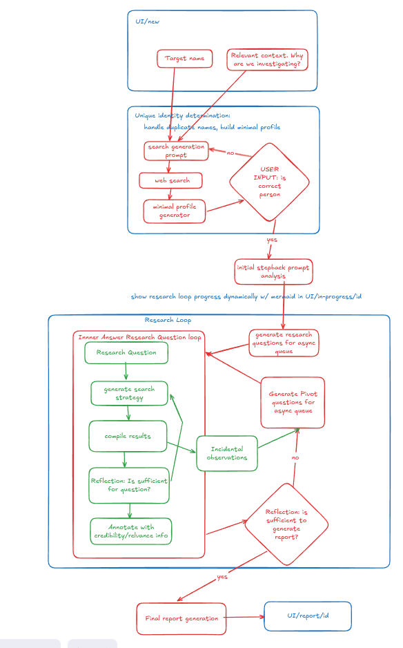

# AutoSpook OSINT Research Agent

An advanced OSINT (Open Source Intelligence) research tool built with **Temporal + LangGraph + LangSmith** architecture for robust, traceable intelligence workflows.

## Prerequisites

- Python 3.8+
- Node.js 16+
- uv (for Python dependency management)
- OpenAI API key
- LangSmith API key (for tracing)
- Temporal server (optional, for advanced workflows)

## Setup

### 1. Environment Variables

Copy `env.example` to `.env` and fill in your API keys:

```bash
cp env.example .env
```

Edit `.env` and add your keys:
```
OPENAI_API_KEY=your_openai_api_key_here
LANGCHAIN_TRACING_V2=true
LANGCHAIN_ENDPOINT=https://api.smith.langchain.com
LANGCHAIN_API_KEY=your_langsmith_api_key_here
LANGCHAIN_PROJECT=autospook
```

### 2. Backend Setup

Install Python dependencies using uv:

```bash
uv sync
```

### 3. Frontend Setup

Install Node.js dependencies:

```bash
cd frontend
npm install
```

## Running the Application

### Quick Start (Recommended)

Use the Makefile to start both services:

```bash
make dev
```

This will:
- Check and install dependencies
- Start the backend server at `http://localhost:8001`
- Start the frontend server at `http://localhost:3000`
- Handle graceful shutdown with Ctrl+C

See all available commands:
```bash
make help
```

### Manual Start

#### Using Make Commands

```bash
# Install dependencies
make install

# Start backend only
make dev-backend

# Start frontend only (in separate terminal)
make dev-frontend
```

#### Traditional Approach

```bash
# Backend
uv run uvicorn backend.main:app --reload --host 0.0.0.0 --port 8001

# Frontend (in separate terminal)
cd frontend && npm start
```

Services will be available at:
- Backend: `http://localhost:8001`
- Frontend: `http://localhost:3000`

## Usage

1. Open your browser to `http://localhost:3000`
2. Type an OSINT research query in the chat interface
3. The LangGraph agent will process your research request and respond with intelligence
4. View comprehensive traces in LangSmith dashboard

## API Endpoints

- `GET /` - API information and health check
- `POST /chat` - Send OSINT research request `{"message": "text", "max_steps": 3}`
- `POST /research` - Alias for chat endpoint
- `GET /health` - Health status

## Architecture

### Target Architecture Overview



The target architecture implements a sophisticated OSINT research workflow that operates in several key phases:

1. **UI/UX Layer**: The user interface accepts research targets and displays "Relevant context: Why are we investigating?" to establish the research context and objectives.

2. **Unique Identity Determination**: The system handles duplicate names and builds criminal profiles through:
   - Search generation prompts that create targeted queries
   - Web search execution across multiple sources
   - Criminal profile generation for comprehensive analysis
   - User validation to confirm the correct target person

3. **Initial Stepback Prompt Analysis**: Once identity is confirmed, the system performs initial analysis of the target.

4. **Research Loop**: The core research engine operates through an iterative process:
   - **Inner Answer Research Question Loop**: Generates research questions, executes search strategies, compiles results, and validates if sufficient information has been gathered
   - **Generate Research Questions**: Creates targeted questions for async processing
   - **Generate Pivot Questions**: Develops follow-up questions based on findings
   - **Incidental Observations**: Captures unexpected discoveries during research
   - **Reflection Process**: Determines if sufficient information exists to generate comprehensive reports

5. **Final Report Generation**: Produces detailed intelligence reports in the UI/report format

This architecture ensures thorough, systematic OSINT research with built-in validation, iterative refinement, and comprehensive reporting capabilities.

### Core Components
- **Backend**: FastAPI with LangGraph OSINT agent and Temporal orchestration
- **Frontend**: React with Axios for API calls
- **Agent**: OSINT research agent using GPT-3.5-turbo with specialized prompts
- **Orchestration**: Temporal workflows for complex research pipelines
- **Tracing**: LangSmith for comprehensive observability

### Key Features
- **OSINT-Focused**: Specialized prompts and workflows for intelligence research
- **Multi-Step Research**: Configurable research depth with step control
- **State Management**: Temporal workflows maintain research state across steps
- **Comprehensive Tracing**: Every operation captured in LangSmith
- **Error Resilience**: Robust error handling and recovery mechanisms

## Advanced Usage

### Temporal Workflows

For complex research pipelines, you can use Temporal workflows:

```bash
# Using Makefile (recommended)
make temporal-start      # Start Temporal infrastructure
make temporal-dev        # Run development with workflows
make temporal-demo       # Run demo workflow
make temporal-stop       # Stop infrastructure

# Manual approach
docker run -d --rm -p 7233:7233 temporalio/auto-setup
python backend/orchestrator.py worker
python backend/orchestrator.py
```

### Development Utilities

```bash
# Check service health
make health

# View service logs
make logs

# Clean build artifacts
make clean

# Stop all services
make stop

# Run tests and linting
make test
make lint
make format
```

## Next Steps

Extend AutoSpook with:

- **Real OSINT Data Sources**: Integrate APIs for social media, public records, domain information
- **Advanced Graph Workflows**: Multi-node research pipelines with decision points
- **Data Persistence**: Store research results and maintain case files
- **Authentication & Authorization**: Secure access control for sensitive research
- **Enhanced UI**: Rich visualizations for research results and data relationships
- **Automated Reporting**: Generate structured intelligence reports
- **Integration Capabilities**: Connect with existing security tools and databases 